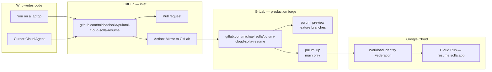
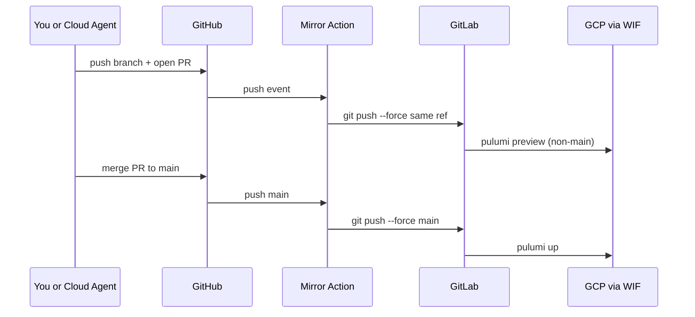

# GitHub inlet, GitLab production forge

This repo lives on **two personal free forges**. They are not interchangeable:

| Forge | Role | Why |
|---|---|---|
| **GitHub** | Inlet | Cursor Cloud Agents clone and open PRs here. Personal GitLab **Free** cannot issue the project access tokens those agents need. |
| **GitLab** | Production forge | Shared runners + Workload Identity Federation run `pulumi preview` / `pulumi up`. No second deploy on GitHub. |

Check in on GitHub. GitLab follows. Do not push only to GitLab, and do not add `pulumi up` to GitHub Actions.



---

## Daily path

1. Branch and commit on **GitHub** (laptop `origin`, or a Cloud Agent).
2. Open a **GitHub** pull request. Review happens there.
3. The **Mirror to GitLab** Action force-pushes the same ref to GitLab.
4. GitLab CI runs **`pulumi preview`** on that feature branch (WIF, same as today).
5. Merge the GitHub PR to `main`.
6. The Action mirrors `main`. GitLab CI runs **`pulumi up`** and Cloud Run updates.



A GitLab merge request is optional. You only need one if you want to show the GitLab review UI. The deploy job does not wait for a GitLab MR.

---

## What lives where


| Item | GitHub | GitLab |
|---|---|---|
| Source of truth for commits | Yes | Mirror |
| Cursor Cloud Agents | Yes | Not on Free |
| `pulumi preview` / `pulumi up` | No | Yes |
| `PULUMI_ACCESS_TOKEN` | No | Yes |
| `GITLAB_TOKEN` (repo write) | Yes | No |
| WIF trust (`project_path`) | No | Yes — pinned to this GitLab project |

If you rename or move the GitLab project, update `infra/gitlab-wif.ts` (`gitlabProjectPath`) and `pulumi up` **before** you change the mirror target. WIF will reject jobs from a new path until that Pulumi apply lands.

---

## One-time setup (required before the Action succeeds)

Both forges are personal **Free** plans. Use a **user** personal access token on GitLab. Project access tokens are Premium-only and are not available here.

### 1. Confirm the GitLab project exists

Default target: `https://gitlab.com/michael.solla/pulumi-cloud-solla-resume`

That path is what WIF already trusts (`gitlabProjectPath` in `infra/gitlab-wif.ts`). Create the project if it is missing. Do not change the path unless you also update WIF.

### 2. Create a GitLab personal access token

1. GitLab → **Preferences → Access Tokens** (user settings, not the project).
2. Name it something obvious, e.g. `github-mirror-pulumi-cloud-solla-resume`.
3. Scope: **`write_repository`** only. Do not add `api` or `sudo`.
4. Copy the token once.

A project **deploy token** with write access also works if you prefer a token that cannot browse your other projects. If you use one, the Action still sends it as `PRIVATE-TOKEN`.

### 3. Store the token on GitHub

1. GitHub repo → **Settings → Secrets and variables → Actions**.
2. New repository secret:
   - Name: `GITLAB_TOKEN`
   - Value: the GitLab token from step 2.

Optional repository **variables** (not secrets) if you ever retarget the mirror:

| Variable | Default |
|---|---|
| `GITLAB_HOST` | `gitlab.com` |
| `GITLAB_PROJECT_PATH` | `michael.solla/pulumi-cloud-solla-resume` |

### 4. Bootstrap GitLab from GitHub

After `GITLAB_TOKEN` is set:

1. **Actions → Mirror to GitLab → Run workflow**.
2. Enable **Push every GitHub branch and tag to GitLab**.
3. Confirm the GitLab project shows the same branches.
4. Confirm a GitLab pipeline ran on `main` only if you intended to deploy. Feature-branch pipelines should be `pulumi preview` only.

Later pushes mirror just the ref that changed. Branch or tag deletes on GitHub delete the same ref on GitLab. The workflow **refuses to delete `main`**.

---

## Using Cursor Cloud Agents with this setup

Start the agent against the **GitHub** repo, not GitLab.

1. Pick the branch you want as the base (`main`, unless you are stacking on another feature branch).
2. Tell the agent the outcome, not the forge dance. It will branch, commit, and open a **GitHub** PR.
3. After the mirror Action is green, GitLab has that branch and should run preview.
4. Review the GitHub PR (and the GitLab preview job). Merge on GitHub.
5. Follow-up messages on the **same** agent URL keep that conversation. A new agent on the phone is a new conversation and does not inherit MacBook Composer history.

The agent does not need `PULUMI_ACCESS_TOKEN` or GCP credentials. It only needs to land commits on GitHub. CI is the identity that is allowed to talk to GCP.

If the mirror job is red with **Missing GITLAB_TOKEN**, the GitHub secret is not set yet. The PR can still be reviewed; GitLab will catch up after you add the secret and re-run the workflow.

---

## Laptop workflow

Once the secret is in place, one remote is enough:

```bash
git remote -v
# origin  https://github.com/michaelsolla/pulumi-cloud-solla-resume.git

git push -u origin HEAD
```

Do not add a `gitlab` push remote “just in case.” Dual-push from the laptop is how the two histories drift, and Cloud Agents cannot see that second remote anyway.

---

## What this Action does not do

- It does not deploy. GitLab `pulumi:deploy` on `main` is the only `pulumi up`.
- It does not open GitLab merge requests.
- It does not copy GitHub Issues, Actions logs, or PR review comments.
- It does not replace WIF with a GitHub OIDC deploy.

A later, thin GitHub Actions **lint/test** workflow is fine. A second Cloud Run deploy is not.

---

## Troubleshooting

| Symptom | Likely cause |
|---|---|
| Mirror job: Missing `GITLAB_TOKEN` | Secret not created, or created on the wrong GitHub repo / environment. |
| `could not read Username for 'https://gitlab.com'` | Git talked to GitLab git HTTP without Basic auth. The workflow now sends `Authorization: Basic` with username `oauth2` and the PAT. Re-run on a commit that includes that fix. |
| `HTTP 401` / `403` from GitLab | Token expired, wrong scope (`write_repository` required), or the user cannot write that project. |
| `HTTP 404` from GitLab | Project path is wrong, or the project is private and the token cannot see it. |
| GitLab preview never runs | Branch did not land on GitLab, or the job rules still think this is `main`. |
| GitLab deploy after a feature push | That push updated `main`. Feature branches must not be named `main`. |
| WIF / `attribute.project_path` errors | GitLab project path no longer matches `infra/gitlab-wif.ts`. |
| Histories diverge | Someone pushed to GitLab only. Re-run the workflow with **full mirror**. |

The mirror **force-pushes** the GitHub ref. GitLab is the follower. A GitLab-only commit on the same branch will be overwritten the next time GitHub pushes that ref.
