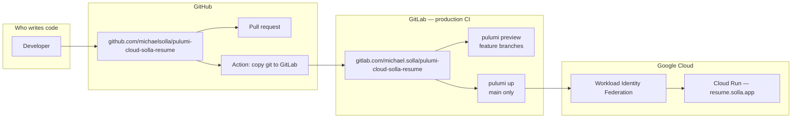
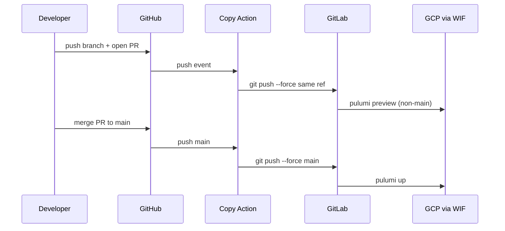
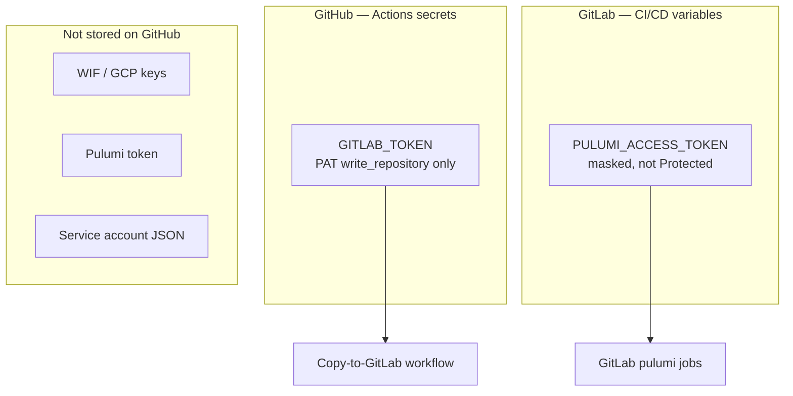

# GitHub and GitLab

This project uses **two** git hosts, each for a distinct job:

| Platform | Role | Why |
|---|---|---|
| **GitHub** | Canonical repository | Commits and pull requests live here. |
| **GitLab** | Production CI | Shared runners plus Workload Identity Federation run `pulumi preview` / `pulumi up`. GitHub Actions does not deploy. |

GitHub is the source of truth. A GitHub Action copies the same git refs to GitLab so CI can run. Pushing only to GitLab, or adding a second `pulumi up` on GitHub, would split history or duplicate deploys.



---

## How a change reaches production

1. A branch is committed on **GitHub**.
2. A **GitHub** pull request is the review surface.
3. The **Mirror to GitLab** Action force-pushes the same ref to GitLab.
4. GitLab CI runs **`pulumi preview`** on that feature branch (WIF).
5. The GitHub PR merges to `main`.
6. The Action copies `main`. GitLab CI runs **`pulumi up`** and Cloud Run updates.



A GitLab merge request is optional. The deploy job does not wait for one.

---

## What lives where



| Item | GitHub | GitLab |
|---|---|---|
| Source of truth for commits | Yes | Copy |
| `pulumi preview` / `pulumi up` | No | Yes |
| `PULUMI_ACCESS_TOKEN` | No | Yes (masked, **not** Protected) |
| `GITLAB_TOKEN` (repo write) | Yes | No |
| WIF trust (`project_path`) | No | Yes — pinned to this GitLab project |

If the GitLab project is renamed or moved, `infra/gitlab-wif.ts` (`gitlabProjectPath`) must be updated and `pulumi up` applied **before** the copy target changes. WIF rejects jobs from a new path until that apply lands.

---

## How the git copy is configured

Both hosts are personal **Free** plans. The copy uses a GitLab **user** personal access token. Project access tokens are Premium-only.

### 1. GitLab project

Default target: `https://gitlab.com/michael.solla/pulumi-cloud-solla-resume`

That path is what WIF already trusts (`gitlabProjectPath` in `infra/gitlab-wif.ts`). Changing it requires a matching WIF update.

### 2. GitLab personal access token

1. GitLab → **Preferences → Access Tokens** (user settings, not the project).
2. Name it something obvious, e.g. `github-mirror-pulumi-cloud-solla-resume`.
3. Scope: **`write_repository`** only — not `api` or `sudo`.
4. Copy the token once.

A project **deploy token** with write access also works if a token that cannot browse other projects is preferred. The Action still sends it as `PRIVATE-TOKEN`.

### 3. Store the token on GitHub

1. GitHub repo → **Settings → Secrets and variables → Actions**.
2. New repository secret:
   - Name: `GITLAB_TOKEN`
   - Value: the GitLab token from step 2.

Optional repository **variables** (not secrets) if the copy target changes:

| Variable | Default |
|---|---|
| `GITLAB_HOST` | `gitlab.com` |
| `GITLAB_PROJECT_PATH` | `michael.solla/pulumi-cloud-solla-resume` |

### 4. Bootstrap GitLab from GitHub

After `GITLAB_TOKEN` is set:

1. **Actions → Mirror to GitLab → Run workflow**.
2. Enable **Push every GitHub branch and tag to GitLab**.
3. Confirm the GitLab project shows the same branches.
4. A pipeline on `main` deploys. Feature-branch pipelines are `pulumi preview` only.

Later pushes copy just the ref that changed. Branch or tag deletes on GitHub delete the same ref on GitLab. The workflow **refuses to delete `main`**.

### 5. Feature-branch preview and the Pulumi token

GitLab **Protected** variables are injected only on protected branches (usually `main`). Feature branches are not protected, so a Protected `PULUMI_ACCESS_TOKEN` makes `pulumi:preview` fail at `pulumi login`.

1. GitLab project → **Settings → CI/CD → Variables** → `PULUMI_ACCESS_TOKEN`.
2. Keep **Masked**.
3. Leave **Protected** unchecked.
4. Retry the failed `pulumi:preview` job (or push again).

On this personal repo that is acceptable: only the owner (and the GitHub copy token) can push branches. A team setup would typically use a second, non-protected preview token instead of unprotecting the deploy token.

The `docker` PATH warning from `gcloud auth configure-docker` is noise. The job already has Docker via the `docker:dind` service; Pulumi talks to `DOCKER_HOST`.

---

## Local git remote

One remote is enough:

```bash
git remote -v
# origin  https://github.com/michaelsolla/pulumi-cloud-solla-resume.git

git push -u origin HEAD
```

A second `gitlab` push remote is how the two histories drift. GitHub is the source of truth; GitLab is the follower.

---

## What this Action does not do

- It does not deploy. GitLab `pulumi:deploy` on `main` is the only `pulumi up`.
- It does not open GitLab merge requests.
- It does not copy GitHub Issues, Actions logs, or PR review comments.
- It does not replace WIF with a GitHub OIDC deploy.

A later, thin GitHub Actions **lint/test** workflow is fine. A second Cloud Run deploy is not.

---

## Troubleshooting

| Symptom | Likely cause |
|---|---|
| Copy job: Missing `GITLAB_TOKEN` | Secret not created, or created on the wrong GitHub repo / environment. |
| `could not read Username for 'https://gitlab.com'` | Git talked to GitLab git HTTP without Basic auth. The workflow now sends `Authorization: Basic` with username `oauth2` and the PAT. Re-run on a commit that includes that fix. |
| `HTTP 401` / `403` from GitLab | Token expired, wrong scope (`write_repository` required), or the user cannot write that project. |
| `HTTP 404` from GitLab | Project path is wrong, or the project is private and the token cannot see it. |
| `PULUMI_ACCESS_TOKEN must be set` / empty token on `pulumi:preview` | GitLab variable is **Protected**. Uncheck Protected, keep Masked, retry the job. |
| GitLab deploy after a feature push | That push updated `main`. Feature branches must not be named `main`. |
| WIF / `attribute.project_path` errors | GitLab project path no longer matches `infra/gitlab-wif.ts`. |
| Histories diverge | Someone pushed to GitLab only. Re-run the workflow with **full mirror**. |

The copy **force-pushes** the GitHub ref. GitLab is the follower. A GitLab-only commit on the same branch is overwritten the next time GitHub pushes that ref.
