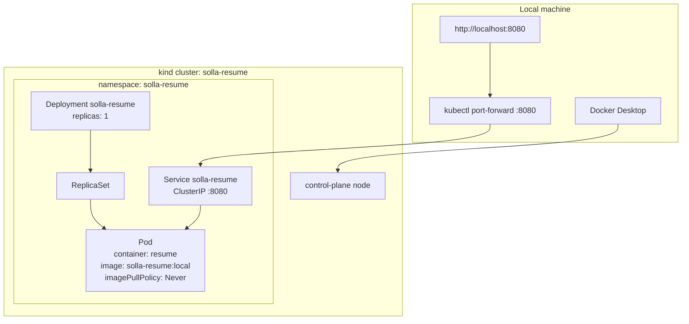

# Local Kubernetes (kind + Pulumi)

Same resume container as Cloud Run, running on a **local kind cluster**, deployed with Pulumi. Nothing here is public, and GitLab CI does not touch this stack.

**Cluster name:** `solla-resume`  
**Kube context:** `kind-solla-resume`  
**Pulumi project / stack:** `pulumi-k8s-local` / `local`

## Cluster shape

kind has no AWS-style console. This is the object graph Pulumi creates (plus the kind control-plane that already exists once `kind create cluster` has run):



kube-system (CoreDNS, apiserver, etc.) is still there; that is the cluster, not the app.

## Inspecting it live

**k9s** is a terminal UI for Kubernetes.

```bash
brew install k9s
k9s --context kind-solla-resume -n solla-resume
```

`:ns` then pick `solla-resume` if k9s opened without `-n`. `deploy`, `po`, `svc` are the usual views. Enter a pod for logs/describe. `?` is help, `q` quits. An empty pod list usually means namespace `default`. If the namespace is missing, run `./scripts/k8s-up.sh` first.

**Headlamp** is a desktop Kubernetes console (CNCF / SIG UI). Closest local analog to the EKS or GKE Workloads UI.

```bash
brew install --cask headlamp
open -a Headlamp
```

Select kubeconfig context **`kind-solla-resume`**, namespace **`solla-resume`**. Service **Endpoints** vs **EndpointSlice** (`solla-resume-xxxxx`) are two API views of the same pod backends, not two apps. Headlamp stays a desktop app for this lab; nothing is installed in-cluster.

## Prerequisites

- Docker Desktop running
- [kind](https://kind.sigs.k8s.io/) (`brew install kind`)
- `kubectl`
- Optional: [k9s](https://k9scli.io/) (`brew install k9s`), [Headlamp](https://headlamp.dev/) (`brew install --cask headlamp`)
- Pulumi CLI (logged in to the same Pulumi Cloud org as the Cloud Run stack)

## Bring the lab up

```bash
./scripts/k8s-up.sh
# other terminal:
kubectl --context kind-solla-resume -n solla-resume port-forward svc/solla-resume 8080:8080
# open http://localhost:8080
```

Tear down the workload (keep the cluster):

```bash
./scripts/k8s-down.sh
```

Tear down the workload **and** delete the kind cluster:

```bash
./scripts/k8s-down.sh --cluster
```

## What Pulumi does

1. Builds `app/Dockerfile` locally (`solla-resume:local`) — no Artifact Registry push.
2. `kind load docker-image` so the node can run it (`imagePullPolicy: Never`).
3. Creates namespace `solla-resume`, a Deployment (1 replica), and a ClusterIP Service on port 8080.

GKE Autopilot is a separate on-demand stack: [GKE.md](GKE.md). This stack stays local on purpose.
