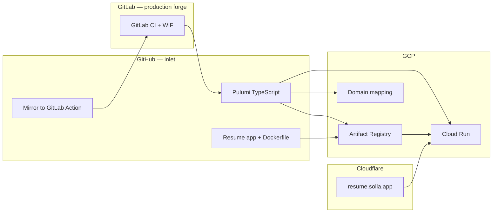

# Solla resume site — project plan

Portfolio and skill-building repo: a containerized resume app on **GCP**, provisioned with **Pulumi TypeScript**. Cloud Run is the always-on public site. Kubernetes (local first, then cheap GKE Autopilot) is the next skill and resume signal. Terraform is an optional later appendix, not the main path — this repo stays Pulumi-first.

**GCP project:** `pulumi-gcp-ed-msolla`  
**Region:** `us-central1`  
**Public URL:** [https://resume.solla.app](https://resume.solla.app)

---

## Architecture (current)



Forge roles, secret placement, and the Cloud Agent loop: [FORGES.md](FORGES.md).

---

## Repository layout

```
pulumi-cloud-solla-resume/
├── app/                    # Resume container (Dockerfile + server.js + PDF)
├── infra/                  # Pulumi TypeScript program (GCP Cloud Run + WIF)
├── infra-k8s/              # Pulumi program for local kind (not GitLab CI)
├── scripts/
│   ├── k8s-up.sh
│   └── k8s-down.sh
├── docs/
│   ├── PLAN.md             # This file
│   ├── K8S-LOCAL.md        # Local kind + Pulumi
│   ├── FORGES.md           # GitHub inlet + GitLab production forge
│   └── CUSTOM-DOMAIN.md    # resume.solla.app DNS / mapping notes
├── .github/workflows/
│   └── mirror-to-gitlab.yml
├── .gitlab-ci.yml          # preview on feature branches, deploy on main (keyless WIF)
└── README.md
```

---

## What is already live

| Piece | Status |
|--------|--------|
| Dockerized Node app serving the resume PDF | Live |
| Pulumi stack: Artifact Registry, Cloud Run v2, domain mapping | Live |
| Custom domain `resume.solla.app` | Live |
| GitLab CI `pulumi preview` / `pulumi up` via GCP Workload Identity Federation | Live (keyless; no SA JSON keys) |
| GitHub as commit inlet; Actions mirror to GitLab | Added — set `GITLAB_TOKEN` to activate (see [FORGES.md](FORGES.md)) |

### Pulumi resources (Cloud Run stack)

- `gcp.projects.Service` — enable required APIs
- `gcp.artifactregistry.Repository` — Docker image repository (+ cleanup policies)
- `gcp.artifactregistry.RepositoryIamMember` — Cloud Run can pull images
- `docker.Image` — build + push container
- `gcp.cloudrunv2.Service` — run the container; scales to zero when idle
- `gcp.cloudrunv2.ServiceIamMember` — unauthenticated HTTP (demo)
- `gcp.cloudrun.DomainMapping` — `resume.solla.app`
- `GitlabCiWif` component — pool, OIDC provider, deployer SA, least-privilege IAM

### Image build strategy: `@pulumi/docker`

During `pulumi up`, a `docker.Image` resource builds from `app/` (platform `linux/amd64`) and pushes to Artifact Registry. Cloud Run should reference **`image.repoDigest`** (immutable `@sha256:...`), not the floating `:latest` tag, so a new push actually rolls a new revision.

**Local test:**

```bash
cd app
docker build --platform linux/amd64 -t hello-world-local .
docker run --rm -p 8080:8080 hello-world-local
```

### Cost (always-on site)

Cloud Run scale-to-zero + the default `*.run.app` URL is cheap. Artifact Registry storage is the main slow leak unless cleanup policies keep only a few recent images.

---

## Roadmap

Order matters. Do not skip ahead to GKE until local Kubernetes is boring.

### 0. Hygiene

- [x] Pin Cloud Run to `image.repoDigest` so CI/local `pulumi up` actually deploys the new image
- [x] Artifact Registry cleanup policies: keep the last few images, delete stale untagged ones

### 1. Local Kubernetes (Pulumi)

Same `app/` container, on this laptop. No GKE yet. No Terraform. See [K8S-LOCAL.md](K8S-LOCAL.md).

- [x] Local cluster via **kind**
- [x] Pulumi Kubernetes provider targeting `kind-solla-resume`
- [x] Deploy the existing image as a Deployment + Service
- [x] Document `kind create` / `pulumi up` / `kubectl port-forward` (`scripts/k8s-up.sh`, `scripts/k8s-down.sh`)

### 2. Cheap GKE Autopilot (on-demand)

- [ ] Separate Pulumi stack (or program) for zonal **GKE Autopilot**
- [ ] Tiny workload; no always-on HTTP(S) load balancer at first
- [ ] Explicit up / destroy workflow (scripts wrapping `pulumi up` / `pulumi destroy`)
- [ ] Tear down when idle — GCP credits still do not make a forgotten cluster + LB free
- [ ] Cloud Run stays the public hub; GKE is a lab, not a second 24/7 site

GKE free tier covers **one Autopilot/zonal control plane**, not Pod compute. Cheapest honest pattern: destroy when not demoing.

### 3. Show the work on the site

- [ ] Kubernetes section on `resume.solla.app` (architecture, “offline by default”)
- [ ] GitLab pipeline badge / link so visitors can see the WIF deploy workflow
- [x] GitHub Actions **mirror** to GitLab (inlet only — not a second `pulumi up`)
- [ ] Optional later: thin GitHub Actions lint/test (still not a replacement for GitLab WIF)

### 4. Optional later (not scheduled)

- Helm on the local/GKE workload once a plain Deployment is solid
- GitHub Actions `workflow_dispatch` for GKE up/down (after local + Autopilot work)
- A **Terraform sidecar folder** only if a specific job hunt needs that signal — not the default path for this repo

### Explicitly out of scope

- **AWS in this repo.** The always-on site stays GCP. Day-job cloud is AWS; this project is for GCP + Pulumi + Kubernetes depth, not a second cloud copy of Cloud Run.

---

## Security notes

- Never commit `.env`, service account JSON, or files matching `*-credentials.json` / `service-account*.json`.
- `Pulumi.yaml` and `Pulumi.dev.yaml` **are** committed. They hold no secrets today; Pulumi encrypts `--secret` values as `secure:` blocks. CI needs them checked out for `gcp:project`.
- The public site allows **unauthenticated** access on purpose for a resume demo.
- Prefer Application Default Credentials locally; no downloaded SA keys.
- GitLab CI authenticates keyless via WIF (`infra/gitlab-wif.ts`, `.gitlab-ci.yml`). `PULUMI_ACCESS_TOKEN` is the only pipeline secret (masked GitLab CI/CD variable, **not** Protected, so feature-branch preview can log in). Keep it on GitLab; never add it to GitHub Actions.
- The GitHub → GitLab mirror uses a GitLab PAT stored as `GITLAB_TOKEN` (`write_repository` only). See [FORGES.md](FORGES.md).
- IAM grants for the deployer SA that change **project IAM** must be applied once with a privileged local identity; CI cannot grant itself new project roles.
