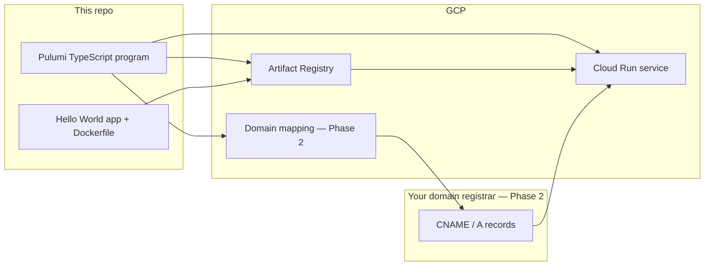

# Cloud Run Hello World — Project Plan

Infrastructure-as-code showcase: a containerized **Hello World** app on **Google Cloud Run**, provisioned entirely with **Pulumi TypeScript**. A custom domain mapping comes in Phase 2.

**GCP project:** `pulumi-gcp-ed-msolla`  
**Region:** `us-central1`

---

## Architecture



---

## Repository layout

```
Pulumi-cloud-solla-resume/
├── app/                    # Hello World container source
│   ├── Dockerfile
│   └── server.js
├── infra/                  # Pulumi TypeScript program
│   ├── Pulumi.yaml
│   ├── index.ts
│   ├── package.json
│   └── tsconfig.json
├── docs/
│   └── PLAN.md             # This file
├── .env                    # Local only (gitignored)
└── README.md
```

---

## Phase 1 — Core showcase (current)

| Piece | Purpose |
|--------|---------|
| **`app/`** | Minimal HTTP server returning `"Hello, World!"` |
| **`Dockerfile`** | Container image for Cloud Run (listens on `PORT`, default 8080) |
| **`infra/`** | Pulumi program that provisions GCP resources |
| **Artifact Registry repo** | Stores the Docker image |
| **`@pulumi/docker` `Image`** | Builds locally and pushes to Artifact Registry during `pulumi up` |
| **Cloud Run v2 service** | Runs the container; scales to zero when idle |
| **IAM** | Public `run.invoker` for demo; Artifact Registry read for Cloud Run |
| **Pulumi outputs** | Service URL (`*.run.app`) for browser testing |

### Pulumi resources (Phase 1)

- `gcp.projects.Service` — enable required APIs
- `gcp.artifactregistry.Repository` — Docker image repository
- `gcp.artifactregistry.RepositoryIamMember` — Cloud Run can pull images
- `docker.Image` — build + push container
- `gcp.cloudrunv2.Service` — run the container
- `gcp.cloudrunv2.ServiceIamMember` — allow unauthenticated HTTP (demo)

### APIs enabled by Pulumi

- `artifactregistry.googleapis.com`
- `run.googleapis.com`

### Image build strategy: `@pulumi/docker`

Phase 1 uses the [**Pulumi Docker provider**](https://www.pulumi.com/registry/packages/docker/) (`@pulumi/docker`), not a separate `pulumi docker` CLI command.

**What it does:**

1. During `pulumi up`, Pulumi declares a `docker.Image` resource in TypeScript.
2. The provider uses your **local Docker daemon** to `docker build` from `app/`.
3. It then **pushes** the image to Artifact Registry (using credentials from `gcloud auth configure-docker`).
4. Cloud Run references that image URL; Pulumi tracks the image as part of infrastructure state.

**Why use it for this showcase:**

- Build, push, and deploy are orchestrated in one `pulumi up`.
- The full pipeline is visible in code — good for a portfolio repo.
- No separate CI step required for the first iteration.

**Prerequisites before `pulumi up`:**

```bash
# Docker Desktop (or equivalent) must be running
docker info

# One-time: teach Docker to authenticate to Artifact Registry
gcloud auth configure-docker us-central1-docker.pkg.dev
```

**Container platform: `linux/amd64`**

Images are built for **amd64** because Cloud Run requires the Linux x86_64 ABI. On Apple Silicon Macs, Docker uses emulation for this build (slower than native ARM, but required for Cloud Run). The Pulumi program sets `platform: "linux/amd64"` on the `docker.Image` resource.

**Local test (matches Cloud Run architecture):**

```bash
cd app
docker build --platform linux/amd64 -t hello-world-local .
docker run --rm -p 8080:8080 hello-world-local
curl http://localhost:8080
```

**Alternatives (later):**

| Approach | When to use |
|----------|-------------|
| **Cloud Build** | Production CI/CD; builds in GCP, not on your laptop |
| **Manual `docker push`** | Quick experiments; less “all-in-Pulumi” |
| **`@pulumi/docker-build`** | Newer provider; BuildKit features |

### Phase 1 workflow

```bash
cd infra
npm install
pulumi stack init dev          # first time only
pulumi config set gcp:project pulumi-gcp-ed-msolla
pulumi config set gcp:region us-central1
pulumi preview
pulumi up
```

Expected outputs:

- `serviceUrl` — open in a browser
- `imageUrl` — full Artifact Registry image reference
- `repositoryUrl` — registry location

### Cost ballpark

Cloud Run free tier covers a hello-world demo (scale-to-zero, minimal traffic). Artifact Registry has small storage costs. No charge for the default `*.run.app` URL.

---

## Phase 2 — Custom domain (later)

When a domain is ready (e.g. `hello.example.com`):

| Step | What happens |
|------|----------------|
| **Domain verification** | Prove ownership in GCP |
| **Cloud Run domain mapping** | Map subdomain → Cloud Run service |
| **DNS records** | Add CNAME/A at your registrar (Pulumi outputs exact values) |
| **HTTPS** | Google-managed certificate after DNS propagates |

**Information needed for Phase 2:**

- Domain name (e.g. `example.com`)
- Subdomain (e.g. `pulumi.example.com` — subdomains are easier than apex)
- DNS host (Cloudflare, Namecheap, Route53, etc.)

**Additional Pulumi resources (Phase 2):**

- `gcp.cloudrun.DomainMapping` (or load balancer pattern for apex domains)
- DNS record outputs for registrar configuration

---

## Roadmap checklist

- [x] Repo scaffolding (GitHub + GitLab)
- [x] GCP account + local `gcloud` auth
- [x] Security-focused `.gitignore`
- [x] Phase 1 plan documented (this file)
- [ ] Phase 1 implemented and deployed
- [ ] Verify `*.run.app` URL in browser
- [ ] Phase 2: custom domain + DNS
- [ ] Optional: GitHub Actions / GitLab CI for `pulumi preview` on PRs

---

## Security notes

- Never commit `.env`, service account JSON, or `Pulumi.*.yaml` stack configs.
- Phase 1 allows **unauthenticated** access for demo purposes; lock down before production.
- Prefer Application Default Credentials locally; avoid downloading service account keys.
