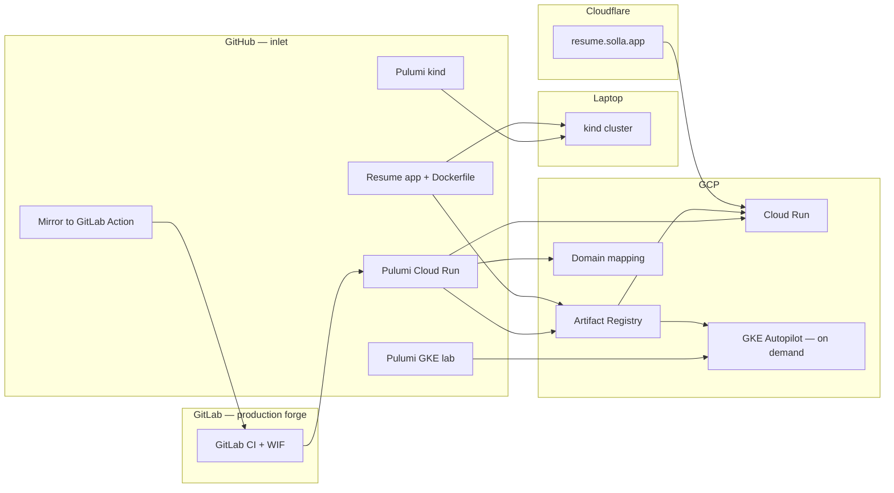

# Solla resume site — project plan

Portfolio and skill-building repo: a containerized resume app on **GCP**, provisioned with **Pulumi TypeScript**. Cloud Run is the always-on public site. Local **kind** is done. Next skill/resume signal is **on-demand GKE Autopilot**. Terraform is an optional later appendix — this repo stays Pulumi-first.

**GCP project:** `pulumi-gcp-ed-msolla`  
**Region:** `us-central1`  
**Public URL:** [https://resume.solla.app](https://resume.solla.app)

Check in on **GitHub**. GitLab is the production forge (mirror Action). See [FORGES.md](FORGES.md). Do not dual-push.

---

## Architecture (current)



Forge roles and secrets: [FORGES.md](FORGES.md). Local kind: [K8S-LOCAL.md](K8S-LOCAL.md). GKE lab: [GKE.md](GKE.md).

---

## Repository layout

```
pulumi-cloud-solla-resume/
├── app/                    # Resume container
├── infra/                  # Pulumi: GCP Cloud Run + WIF (GitLab CI)
├── infra-k8s/              # Pulumi: local kind (not CI)
├── infra-gke/              # Pulumi: on-demand Autopilot (not CI)
├── scripts/
│   ├── k8s-up.sh / k8s-down.sh
│   └── gke-up.sh / gke-down.sh
├── docs/
│   ├── PLAN.md
│   ├── K8S-LOCAL.md
│   ├── GKE.md
│   ├── FORGES.md
│   └── CUSTOM-DOMAIN.md
├── .github/workflows/mirror-to-gitlab.yml
├── .gitlab-ci.yml          # Cloud Run stack only
└── README.md
```

---

## What is already live

| Piece | Status |
|--------|--------|
| Resume container on Cloud Run + `resume.solla.app` | Live |
| Artifact Registry + digest-pinned Cloud Run deploys + cleanup policies | Live |
| GitLab CI `preview` / `up` via WIF (keyless) | Live |
| GitHub inlet; Actions mirror to GitLab | Live |
| Local kind + Pulumi (`infra-k8s`), k9s + Headlamp for inspect | Laptop (not public) |

### Inspect tools (local cluster)

- **k9s** — terminal UI. Name is K8s + s (“Kubernetes screens”), not an acronym.
- **Headlamp** — desktop console; closest local analog to EKS / GKE Workloads.
- **kubectl port-forward** — http://localhost:8080 for the app itself.

On GKE later, use **GCP → Kubernetes Engine → Workloads** plus the same k9s/Headlamp after `get-credentials`.

---

## Roadmap

### 0. Hygiene

- [x] Pin Cloud Run to `image.repoDigest`
- [x] Artifact Registry cleanup policies

### 1. Local Kubernetes (Pulumi)

- [x] kind cluster + Pulumi Deployment/Service
- [x] Scripts + [K8S-LOCAL.md](K8S-LOCAL.md) (mermaid, k9s, Headlamp)

### 2. Cheap GKE Autopilot (on-demand) — current

- [ ] Separate Pulumi project (`infra-gke/`, stack `lab`) — **code in progress; not applied until you approve cost**
- [ ] Tiny Autopilot workload; **no** HTTP(S) load balancer
- [ ] `scripts/gke-up.sh` / `gke-down.sh`
- [ ] Tear down when idle
- [ ] Cloud Run stays the public hub

GKE free tier = one Autopilot **control plane** credit, not free Pods. No always-on public GKE URL.

### 3. Show the work on the site (after GKE can exist)

- [ ] Kubernetes section on `resume.solla.app` (architecture, “lab offline by default”)
- [ ] GitLab pipeline badge / link (WIF deploy)
- [x] GitHub → GitLab mirror
- [ ] Optional: thin GitHub Actions lint/test (not a second deploy)

Do not redesign the homepage until there is a cloud K8s story to point at — even if that cluster is usually destroyed.

### 4. Optional later

- Helm once a plain Deployment is solid
- GitHub Actions `workflow_dispatch` for GKE up/down (after Autopilot works locally)
- Terraform sidecar **only** if a job hunt needs that signal

### Explicitly out of scope

- **AWS in this repo**
- Dual-push to GitLab; GitLab MRs unless requested
- Putting `pulumi up` for GKE on every GitLab `main` pipeline (would leave spend running)
- Kubernetes Dashboard in-cluster for the laptop lab

---

## Security notes

- Never commit `.env`, SA JSON, or `*-credentials.json` / `service-account*.json`.
- `Pulumi.yaml` and allowlisted stack configs (`Pulumi.dev.yaml`, `Pulumi.local.yaml`, `Pulumi.lab.yaml`) **are** committed.
- Public Cloud Run is unauthenticated on purpose.
- ADC locally; no downloaded SA keys.
- GitLab CI: WIF + `PULUMI_ACCESS_TOKEN` (masked, **not** Protected). Never put that token on GitHub.
- `GITLAB_TOKEN` on GitHub is mirror-only (`write_repository`).
- Project-IAM grants for `gitlab-ci-deployer` must be applied once with a privileged identity; CI cannot self-escalate.
- GKE lab uses **your** local ADC when you run `gke-up.sh`, not the GitLab deployer SA (until we add that on purpose).
